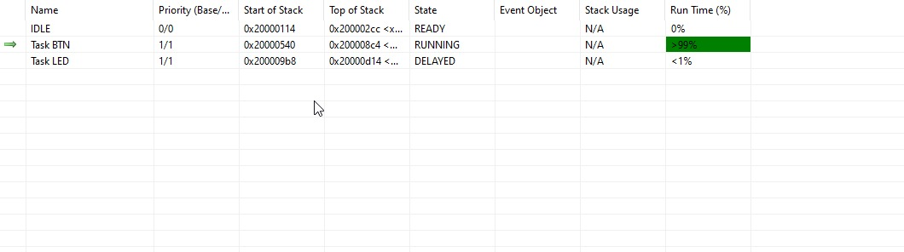
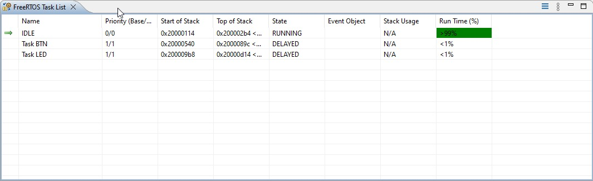

# Actividad 4 - paso 2

## ¿Cómo implementar el procesamiento periódico mediante una Tarea?

Para que sea periodico podemos usar `vTaskDelayUntil` que hace un delay de la tarea exacto, independiente de en que punto se llamo la función.
En cambio `vTaskDelay` hace que el tiempo que se va a dormir la tarea sea relativo al llamado de esta.

## ¿Cuándo se ejecutará la Tarea IDLE y cómo se puede utilizar?

Al ser la de menor prioridad, esta se ejecutara cuando todas las otras tareas esten bloqueadas.

Al ser una tarea mas de FreeRTOS, se puede modificar la función para que ejecute codigo propio.

# Actividad 4 - paso 3 y 4

En ambos casos se sumo un `vTaskDelayUntil` de modo que se bloqueen las tareas durante cierto tiempo. A modo de prueba se probo con dos delays diferentes:
- 100 ms: Esperamos que funcione igual que antes pero sin las tareas ocupando 100% de la ejecución.
- 5000 ms: En este caso como 5000 ms es mayor al delay de las FSM, los leds y botones pasaran a tener delays de este largo.

Entonces, el codigo que se sumo fue el siguiente:

```c
void task_led(void *parameters)
{
    // ........
	TickType_t lastTime = xTaskGetTickCount(); // Get the first tick for the delay
    // ........

	for (;;)
	{
    	task_led_statechart();
    	vTaskDelayUntil(&lastTime, pdMS_TO_TICKS(100)); // delay for 100 ms the task
	}
}
```

de modo que poniendo el delay solo en el led:



Se observa, que el mayor consumo lo lleva la tarea de boton porque la del led esta bloqueada por el delay y a su vez es de mayor prioridad que la tarea IDLE.

Con el delay en las dos tareas:



Como ahora ambas tareas poseen delay, se bloquean de modo que la mayor parte del tiempo queda en la tarea IDLE.
