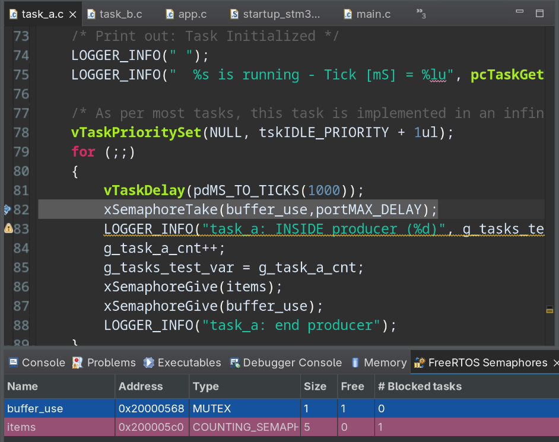
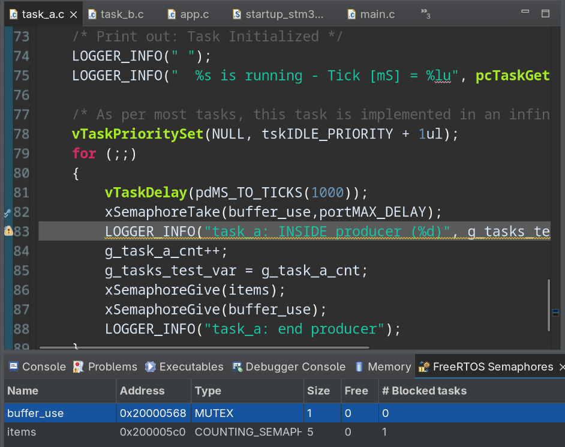
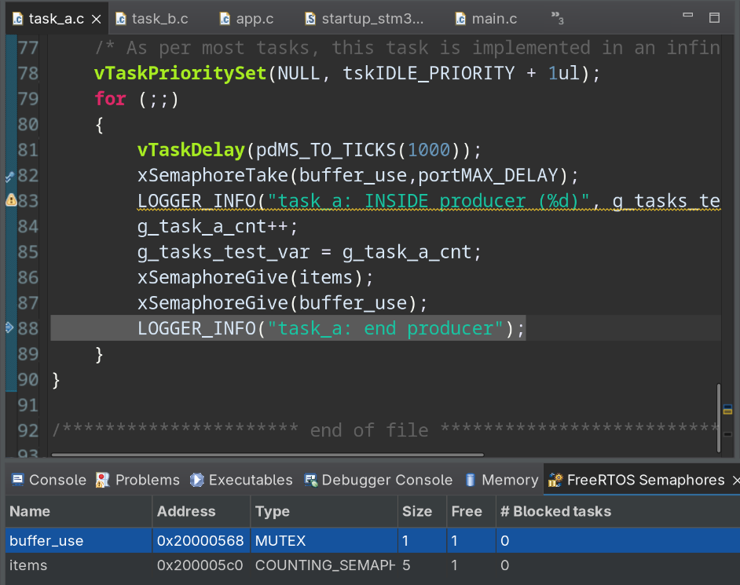
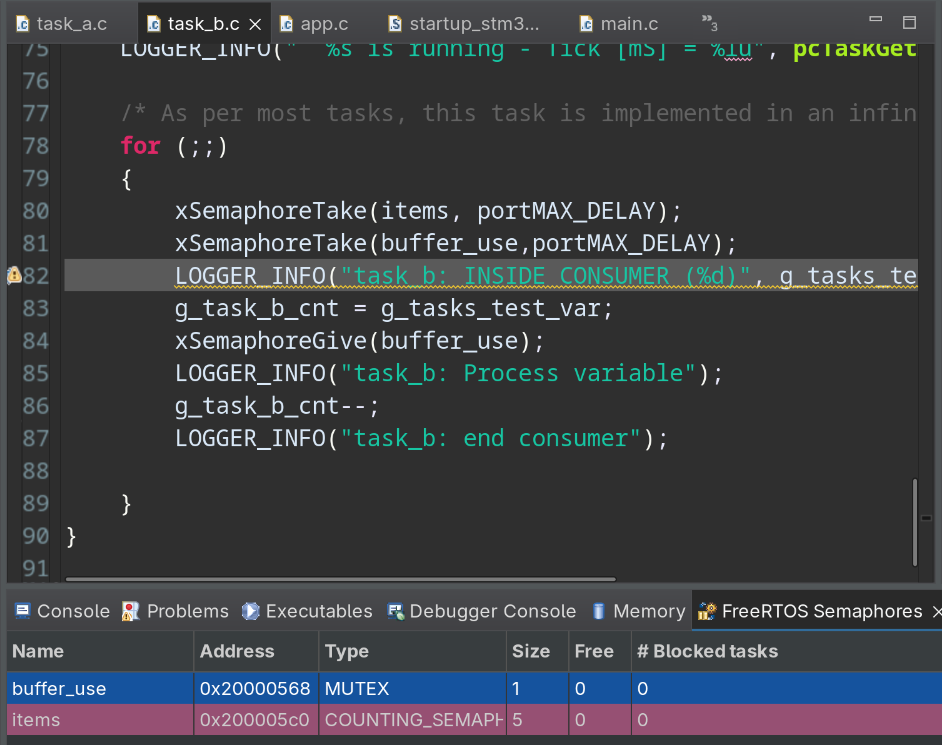
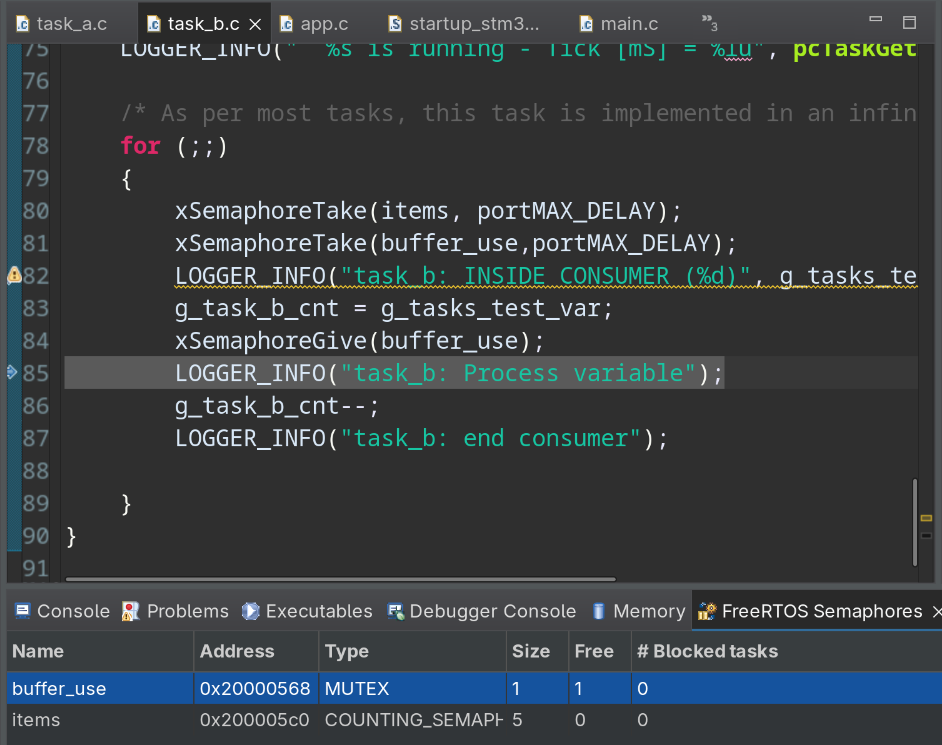

# Análisis y Explicación del Código Fuente (FreeRTOS)

Este código fuente corresponde a un proyecto base desarrollado sobre **FreeRTOS** para la materia _Sistemas Operativos de Tiempo Real_ (de la FIUBA / UTN-FRBA, dictada por el Ing. Juan Manuel Cruz). El sistema está diseñado conceptualmente para resolver el clásico problema de sincronización de **Productor-Consumidor**, aunque en esta versión actual el mecanismo de sincronización (colas o semáforos) está preparado en los comentarios pero aún no ha sido implementado formalmente.

A continuación, se presenta un análisis y explicación estructurada del funcionamiento de cada archivo y de la dinámica global del sistema.

---

## 1. Resumen Ejecutivo del Sistema

El sistema inicializa el entorno de FreeRTOS, configura un manejador de interrupciones básico y lanza **dos tareas independientes (`Task A` y `Task B`)** con la misma prioridad. Ambas tareas interactúan con el planificador (scheduler) bloqueándose periódicamente a través de retrasos temporales (`vTaskDelay`). Mientras ambas tareas están durmiendo, el sistema ejecuta la tarea inactiva (_Idle Task_) del sistema operativo.

---

## 2. Análisis Detallado por Archivo

### 📄 `app.c` (Punto de Entrada de la Aplicación)

Este archivo se encarga de la configuración inicial del software de la aplicación antes de que el planificador de FreeRTOS tome el control total del procesador.

- **Inicialización de Variables Globales:** Configura contadores globales de diagnóstico a cero (`g_app_cnt`, `g_app_tick_cnt`, `g_task_idle_cnt`, etc.).
- **Mensajes Informativos:** Utiliza un módulo de logging (`LOGGER_INFO`) para imprimir en consola el nombre del proyecto y advertir que está basado en los patrones de sincronización del libro _"The Little Book of Semaphores"_.
- **Creación de Tareas:** Llama a la API de FreeRTOS `xTaskCreate` para dar vida a las dos tareas principales:
  - **Task A:** Nombre interno `"Task A"`, prioridad 1 (`tskIDLE_PRIORITY + 1ul`), tamaño de stack mínimo.
  - **Task B:** Nombre interno `"Task B"`, prioridad 1 (`tskIDLE_PRIORITY + 1ul`), tamaño de stack mínimo.
- **Control de Errores:** Utiliza `configASSERT(pdPASS == ret)` para congelar la ejecución si el sistema se queda sin memoria RAM (Heap) al intentar crear las tareas.
- **Inicializaciones Secundarias:** Llama a `app_it_init()` (interrupciones) y a `cycle_counter_init()` (contador de ciclos del procesador, comúnmente usando el bloque DWT de ARM Cortex-M).

> 💡 **Nota de diseño:** En este archivo se observan comentarios clave listos para cuando se agreguen Colas (`QueueHandle_t`), Semáforos (`SemaphoreHandle_t`) o Mutexes, elementos que transformarán estas tareas en un verdadero Productor y Consumidor sincronizado.

---

### 📄 `task_a.c` y `task_b.c` (Las Tareas del Sistema)

Ambos archivos contienen las funciones que se ejecutan de forma concurrente bajo un bucle infinito (`for (;;)`), comportamiento estándar en sistemas embebidos de tiempo real.

| Característica         | `task_a.c` (`Task A`)         | `task_b.c` (`Task B`)                              |
| :--------------------- | :---------------------------- | :------------------------------------------------- |
| **Prioridad**          | 1 (Igual que Task B)          | 1 (Igual que Task A)                               |
| **Contador local**     | Incrementa `g_task_a_cnt`     | Incrementa `g_task_b_cnt`                          |
| **Tiempo de Bloqueo**  | **250 ms** (`TASK_A_DEL_MAX`) | **2500 ms** (2.5 segundos) (`TASK_B_DEL_MAX`)      |
| **Mensaje en Consola** | `"==> Task A - Wait: 250mS"`  | `"==> Task B - Wait: 250mS"` _(Ver detalle abajo)_ |

⚠️ **Curiosidad / Error de Consistencia en `task_b.c`:** El string definido como `p_task_b_wait_250mS` dice textualmente `"Wait: 250mS"`, pero la macro real de retraso que utiliza es `TASK_B_DEL_MAX`, configurada en **2500ul** milisegundos. Por lo tanto, por pantalla dirá que espera 250ms, pero en la realidad el sistema operativo la despertará cada 2.5 segundos.

---

### 📄 `freertos.c` (Funciones de Captura o "Hooks")

Este archivo contiene funciones de callback (_Hooks_) que FreeRTOS invoca automáticamente ante determinados eventos del sistema operativo:

- **`vApplicationIdleHook`:** Se ejecuta repetidamente únicamente cuando **ninguna** tarea de la aplicación está lista para correr (es decir, cuando Task A y Task B están bloqueadas en su `vTaskDelay`). Aquí adentro incrementa el contador `g_task_idle_cnt`. En sistemas de producción, este es el lugar ideal para poner al microcontrolador en modo de bajo consumo (_Low Power Mode_).
- **`vApplicationTickHook`:** Se ejecuta dentro de la Interrupción del Tick de FreeRTOS (ISR). Cada vez que el reloj del sistema genera un tick físico (usualmente cada 1 ms), se incrementa `g_app_tick_cnt`. Al ejecutarse en contexto de interrupción, debe ser sumamente rápida.
- **`vApplicationStackOverflowHook`:** Es un mechanism de seguridad. Si alguna tarea supera el tamaño de stack asignado (`configMINIMAL_STACK_SIZE`), FreeRTOS detecta la corrupción de memoria y salta aquí. El código entra en una sección crítica y se congela deliberadamente en `configASSERT(0)` para permitir al desarrollador conectar un depurador (Debugger) y ver qué falló.

---

### 📄 `app_it.c` (Configuración de Interrupciones)

Contiene la función `app_it_init(void)`. Actualmente es una plantilla vacía para configuraciones específicas de hardware. Lo único que hace de manera demostrativa es deshabilitar las interrupciones globales del procesador mediante lenguaje ensamblador (`CPSID i`) y volverlas a habilitar inmediatamente (`CPSIE i`) para ejemplificar cómo se protegería una región crítica de código frente a accesos concurrentes por interrupción.

---

## 3. Dinámica Temporal y Ejecución del Sistema

Cuando el planificador de FreeRTOS inicia (`vTaskStartScheduler`), el flujo del procesador se comporta de la siguiente manera:

1. El planificador ve que tanto **Task A** como **Task B** están listas (`Ready`) y tienen la misma prioridad (1). Ejecuta una de ellas (por ejemplo, Task A).
2. **Task A** se ejecuta, incrementa su contador, imprime el mensaje en el log y ejecuta `vTaskDelay(250)`. Al hacer esto, pasa al estado Bloqueado (`Blocked`).
3. El planificador busca la siguiente tarea con mayor prioridad lista. Es **Task B**.
4. **Task B** se ejecuta, incrementa su contador, imprime su mensaje en el log y ejecuta `vTaskDelay(2500)`. Pasa al estado Bloqueado.
5. Como ambas tareas están bloqueadas, el planificador le da el control a la tarea **Idle** del sistema, la cual ejecuta constantemente `vApplicationIdleHook()`, incrementando velozmente el contador `g_task_idle_cnt`.
6. A los **250 ms**, el Tick del sistema (que incrementa `g_app_tick_cnt`) despierta a **Task A**. Task A pasa a `Ready`, interrumpe a la tarea Idle por tener mayor prioridad (1 > 0), procesa su bucle y vuelve a dormirse por otros 250 ms.
7. Este ciclo se repite. Por cada **10 veces** que Task A se despierta y ejecuta, Task B se despertará **1 sola vez** (ya que su periodo es de 2500 ms).

## 4. Paso 09

Se implemento el problema de Productor-Consumidor de manera tal que la task_a fue asignada como la productora de una variable (`g_tasks_test_var`). En el loop de la funcion de la tarea se incluyo el siguiente codigo

```c
for(;;;){
    vTaskDelay(pdMS_TO_TICKS(1000));
    xSemaphoreTake(buffer_use,portMAX_DELAY);                       // Mutex para el uso de la variable global
    LOGGER_INFO("task_a: INSIDE producer (%d)", g_tasks_test_var);
    g_task_a_cnt++;                                                 // Variable local a task_a.c
    g_tasks_test_var = g_task_a_cnt;                                // Variable global compartida
    xSemaphoreGive(items);                                          // Semaforo para indicar eventos
    xSemaphoreGive(buffer_use);
    LOGGER_INFO("task_a: end producer");
}
```
Lo que se hace usar un semaforo mutex para restringir el acceso al recurso compartido (`g_tasks_test_var`), el cual toma de valor una variable local que se incrementa por cada iteración.

Previo a la devolucion del mutex, se hace un give del semaforo contador `items` que notificara la tarea consumidora de un evento.

El siguiente codigo corresponde al loop de la tare consumidora (`task_b.c`):
```c
for (;;)
{
    xSemaphoreTake(items, portMAX_DELAY);
    xSemaphoreTake(buffer_use,portMAX_DELAY);
    LOGGER_INFO("task_b: INSIDE CONSUMER (%d)", g_tasks_test_var);
    g_task_b_cnt = g_tasks_test_var;
    xSemaphoreGive(buffer_use);
    LOGGER_INFO("task_b: Process variable");
    g_task_b_cnt--;
    LOGGER_INFO("task_b: end consumer");
}
```

En la siguiente imagen se observa que en la primer iteracion el mutex se encuentra libre y el semaforo contador no tiene elementos:


Luego del take, vemos como el free cambia su valor a 0:


Posterior a los dos gives, vemos como el mutex esta libre y se incremento el semaforo contador:

En la tarea consumidora, podemos ver como los dos takes decrementan los valores de los semaforos:

Finalmente, una vez usa `g_tasks_test_var` se libera el mutex:

