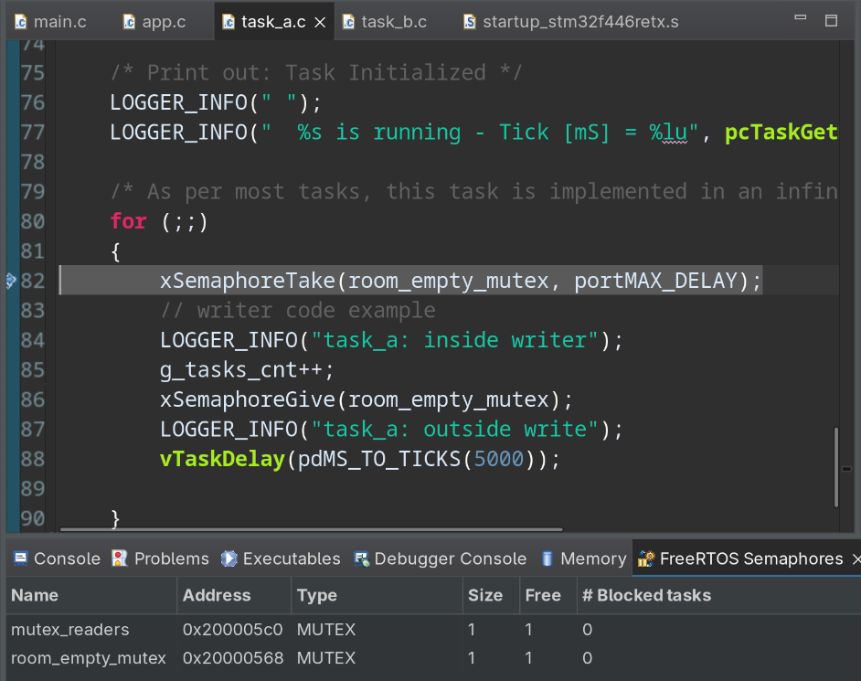
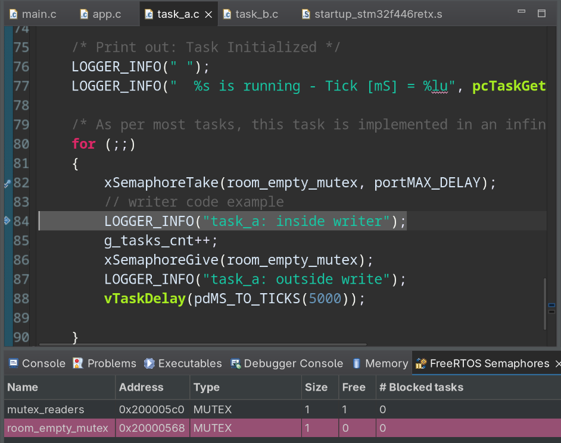
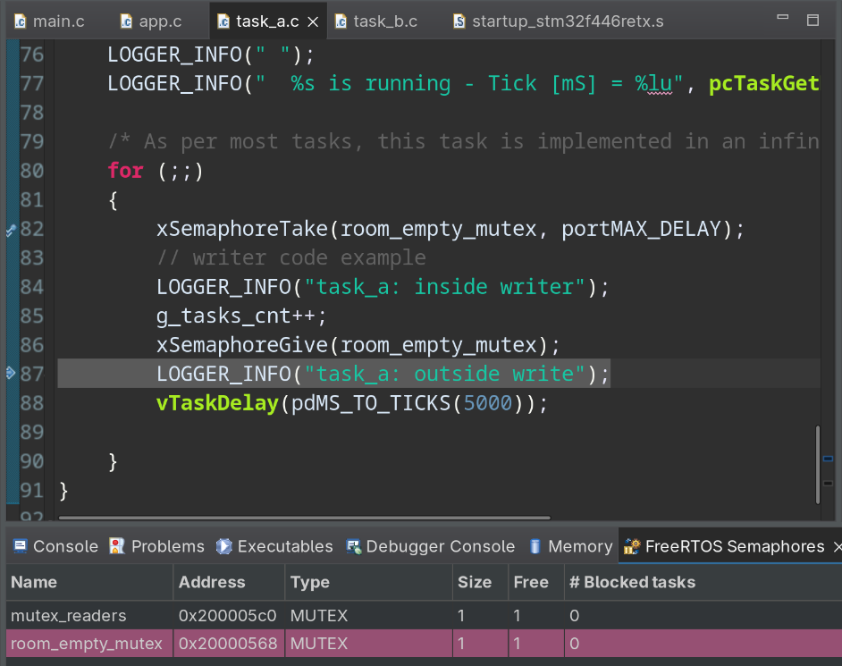
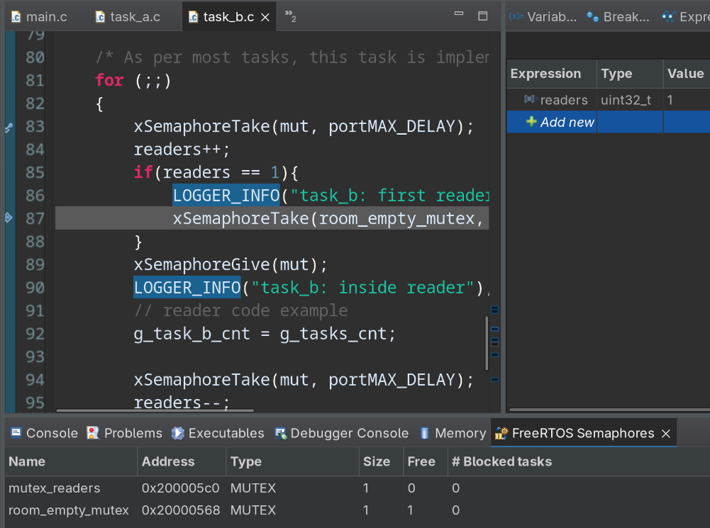
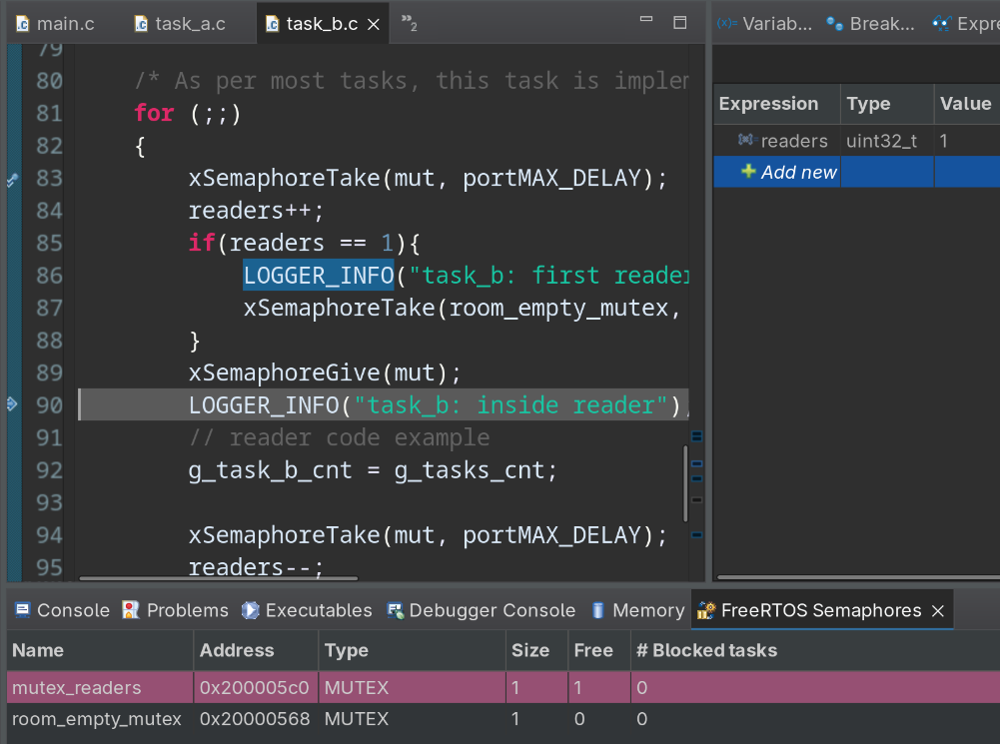
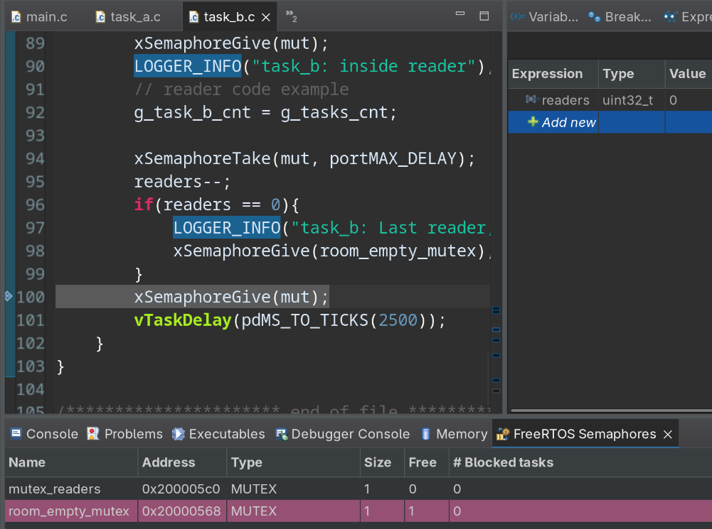

# Análisis y Explicación del Código Fuente (FreeRTOS)

El sistema implementa una aplicación multihilo básica utilizando el sistema operativo de tiempo real **FreeRTOS**. El código está estructurado bajo un paradigma orientado a **Sistemas Disparados por Eventos (ETS - Event-Triggered Systems)** y sienta las bases estructurales para resolver el problema clásico de sincronización de **Lectores-Escritores (Readers-Writers Problem)**.

---

## 1. app.c (Inicialización de la Aplicación)

Este archivo es el núcleo de la configuración del sistema. Define variables globales de control, maneja la configuración inicial de los recursos y crea las tareas principales.

### Funcionamiento Clave:

- **Sección de Inicialización (`app_init`):** Resetea los contadores globales del sistema (`g_app_cnt`, `g_app_tick_cnt`, etc.) y envía mensajes de diagnóstico mediante un registrador (`LOGGER_INFO`) para identificar la versión y la procedencia académica del software.
- **Creación de Tareas:** Utiliza la API nativa de FreeRTOS `xTaskCreate()` para instanciar dos hilos de ejecución independientes:
  - **Task A:** Registrada con el nombre `"Task A"`, un tamaño de stack mínimo (`configMINIMAL_STACK_SIZE`) y una prioridad inicial de **1** (`tskIDLE_PRIORITY + 1ul`).
  - **Task B:** Registrada con el nombre `"Task B"`, con el mismo tamaño de stack mínimo y compartiendo exactamente la misma prioridad inicial (**prioridad 1**).
- **Control de Errores:** Se utiliza `configASSERT(pdPASS == ret)` después de crear cada tarea para colgar o congelar el sistema de manera segura si la asignación de memoria en el _heap_ falla.
- **Habilitación de Periféricos de Bajo Nivel:** Al final, invoca a `app_it_init()` para configurar interrupciones e inicializa un contador de ciclos de hardware (`cycle_counter_init`) útil para métricas de rendimiento y depuración.

---

## 2. task_a.c y task_b.c (Hilos de Ejecución)

Ambos archivos contienen la implementación de los hilos de trabajo independientes creados en `app.c`. Comparten una estructura de bucle infinito (`for(;;)`), común en sistemas embebidos de tiempo real.

### `task_a.c` (Periodicidad Alta)

- **Comportamiento:** Incrementa de forma monótona un contador global propio (`g_task_a_cnt`).
- **Temporización:** Envía un mensaje por el puerto de log y pasa al estado **Bloqueado (Blocked)** por un período corto de **250 ms** mediante la función `vTaskDelay(pdMS_TO_TICKS(250ul))`. Esto libera el uso de la CPU para que otras tareas de igual o menor prioridad se ejecuten.

### `task_b.c` (Periodicidad Baja)

- **Comportamiento:** Incrementa de manera similar su propio contador global (`g_task_b_cnt`).
- **Temporización:** La diferencia crítica radica en su tiempo de bloqueo. Llama a `vTaskDelay` con un retraso masivo de **2500 ms** (2.5 segundos).

> **Nota de Planificación:** Como ambas tareas comparten la misma prioridad (Prioridad 1), el planificador (_scheduler_) de FreeRTOS las alternará por tiempo compartido (_Round-Robin_) cuando ambas estén listas. Sin embargo, dado que pasan la mayor parte del tiempo bloqueadas, el procesador alternará eficientemente entre ellas según expiren sus temporizadores de retardo.

---

## 3. freertos.c (Funciones de Captura o Hooks)

Este archivo implementa las funciones _Hook_ (o callbacks), que son rutinas llamadas internamente por el núcleo de FreeRTOS ante eventos específicos del sistema operativo.

- **`vApplicationIdleHook(void)`:** Se ejecuta repetidamente dentro de la tarea de menor prioridad del sistema: la tarea _Idle_. Solo corre cuando ni **Task A** ni **Task B** están listas para ejecutarse. Aquí se incrementa un contador de ocio (`g_task_idle_cnt`). Este punto es ideal para colocar al microcontrolador en modos de bajo consumo (_Low Power States_).
- **`vApplicationTickHook(void)`:** Se ejecuta de forma automática desde la rutina de servicio de interrupción (ISR) del _Tick_ del sistema operativo. Incrementa `g_app_tick_cnt`. Al ejecutarse dentro de un contexto de interrupción, tiene restricciones estrictas: debe ser sumamente corta y no puede invocar funciones de la API de FreeRTOS que bloqueen o que no terminen en `...FromISR`.
- **`vApplicationStackOverflowHook(...)`:** Se dispara inmediatamente si FreeRTOS detecta que el puntero de pila de alguna tarea ha superado el límite del stack asignado (desbordamiento de memoria). Para evitar comportamientos erráticos o daños de datos, entra en una sección crítica y detiene la ejecución por completo mediante un `configASSERT(0)` facilitando la depuración mediante hardware.

---

## 4. app_it.c (Inicialización de Interrupciones)

Este archivo contiene la función `app_it_init()`, responsable de preparar la configuración de interrupciones específicas de la aplicación.

- Actualmente actúa como una plantilla o esqueleto físico para desarrollos futuros.
- Muestra el uso de instrucciones en lenguaje ensamblador embebido (`__asm("CPSID i")` y `__asm("CPSIE i")`) para deshabilitar y volver a habilitar de forma global las interrupciones del núcleo ARM Cortex-M. Esto se realiza para garantizar la ejecución atómica (sin interrupciones) de bloques de código críticos durante la inicialización.

---

## Resumen del Comportamiento Dinámico

Al arrancar el sistema, se ejecutan las inicializaciones de hardware y se crean las tareas `Task A` y `Task B` con prioridad 1. Una vez que el planificador de FreeRTOS toma el control:

1. Ambas tareas imprimen su estado inicial e incrementan sus contadores.
2. Se bloquean por el tiempo estipulado (250 ms y 2500 ms respectivamente).
3. Mientras están bloqueadas, el procesador ejecuta la tarea _Idle_, invocando el `vApplicationIdleHook` de manera continua para maximizar la eficiencia o el ahorro energético.
4. Cada 1 ms (típicamente), la interrupción del _Tick_ despierta al sistema, ejecuta el `vApplicationTickHook` y evalúa si el tiempo de bloqueo de `Task A` o `Task B` ha expirado para devolverlas al estado "Listo" (_Ready_).

## Paso 06

Se implemento el problema de Readers-Writers de manera tal que la task_a fue asignada como la escritora de una variable (`g_tasks_cnt`). En el loop de la funcion de la tarea se incluyo el siguiente codigo:
```c
for (;;){
    xSemaphoreTake(room_empty_mutex, portMAX_DELAY);    // Mutex para proteger la variable
    // writer code example
    LOGGER_INFO("task_a: inside writer");
    g_tasks_cnt++;                                      // Variable contadora se escribe
    xSemaphoreGive(room_empty_mutex);
    LOGGER_INFO("task_a: outside write");
    vTaskDelay(pdMS_TO_TICKS(5000));
}
```

Por otro lado, la tarea lectora bloquea el recurso de la escritora. Ademas, bloquea a otras lectoras mientras modifica la variable `readers`, que lleva la cuenta de cuantos lectores hay. El recurso se liberara cuando ya no queden lectores accediendo a este.

El siguiente codigo es el de la tarea lectora:
```c
for (;;) {
    xSemaphoreTake(mut, portMAX_DELAY);
    readers++;
    if(readers == 1){
        LOGGER_INFO("task_b: first reader, blocking writers");
        xSemaphoreTake(room_empty_mutex, portMAX_DELAY);
    }
    xSemaphoreGive(mut);
    LOGGER_INFO("task_b: inside reader");
    // reader code example
    g_task_b_cnt = g_tasks_cnt;

    xSemaphoreTake(mut, portMAX_DELAY);
    readers--;
    if(readers == 0){
        LOGGER_INFO("task_b: Last reader, writers free");
        xSemaphoreGive(room_empty_mutex);
    }
    xSemaphoreGive(mut);
    vTaskDelay(pdMS_TO_TICKS(2500));
}
```

En la siguiente imagen se observa que en la primer iteracion el mutex para el escritor (`room_empty_mutex`) y el de los lectores estan libres:


Luego del take, vemos como el free de `room_empty_mutex` cambia su valor a 0 para que la escritora pueda modificar el recurso (`g_tasks_cnt`):


Una vez escrito, se libera el mutex de la escritora:


Desde la lectora, vemos como se tomo el mutex de los readers. Además, como es el primer reader, tambien bloquea a la escritora con `room_empty_mutex`:


Una vez termina de usar `readers`, libera `mut` para que otras lectoras puedan usarla:


Una vez que todos los readers accedieron a la variable, se libera `room_empty_mutex` para que la escritora pueda modificar el recurso:

