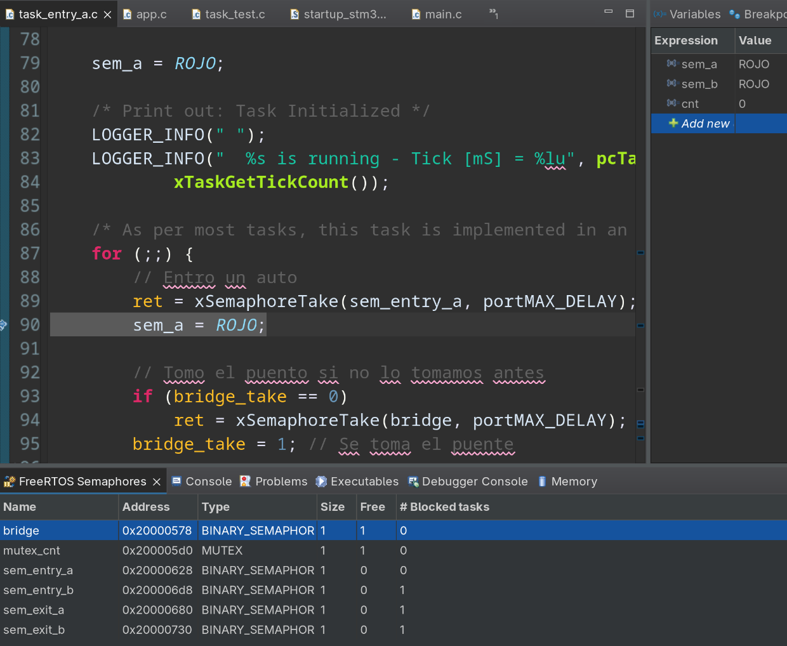
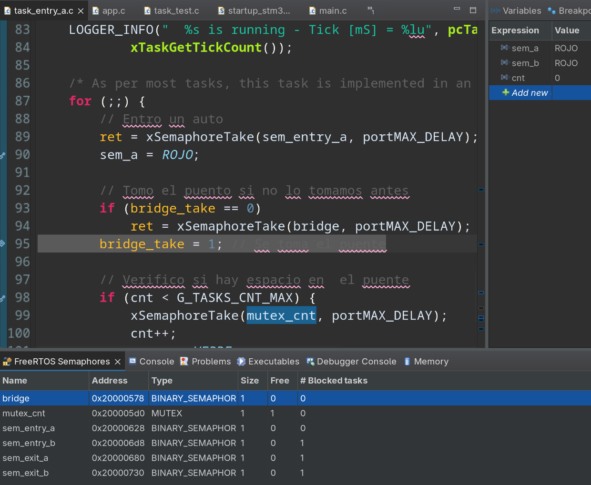
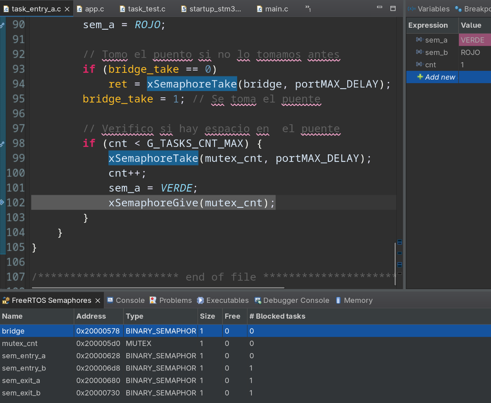
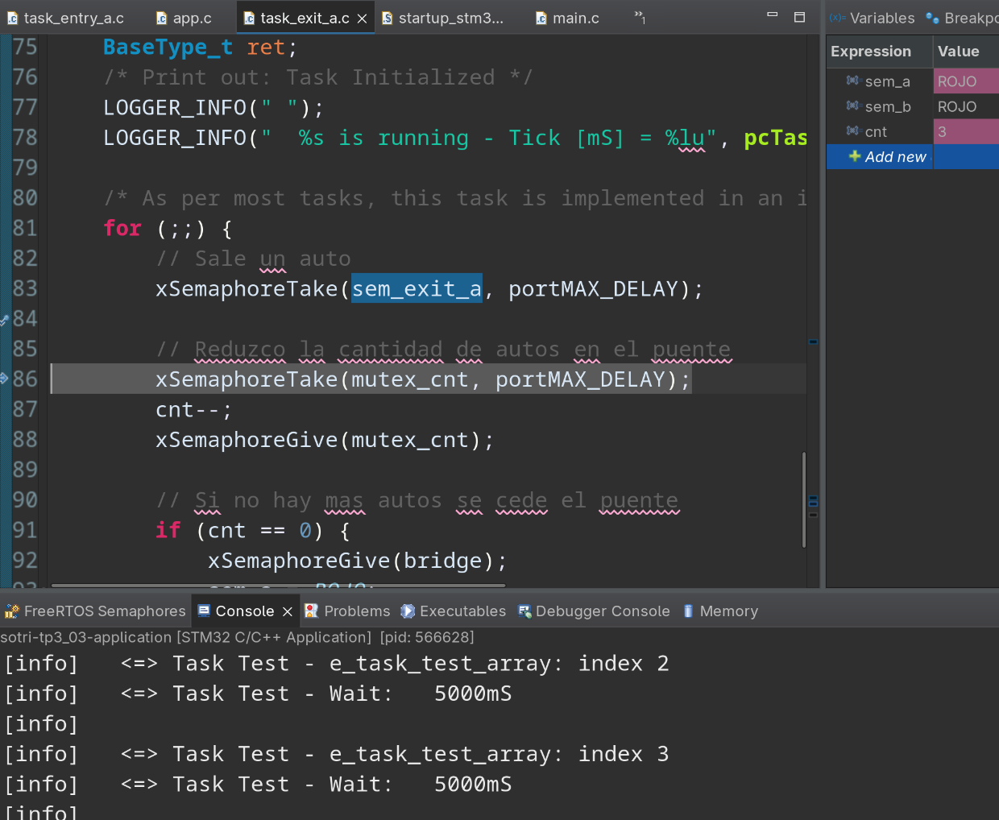
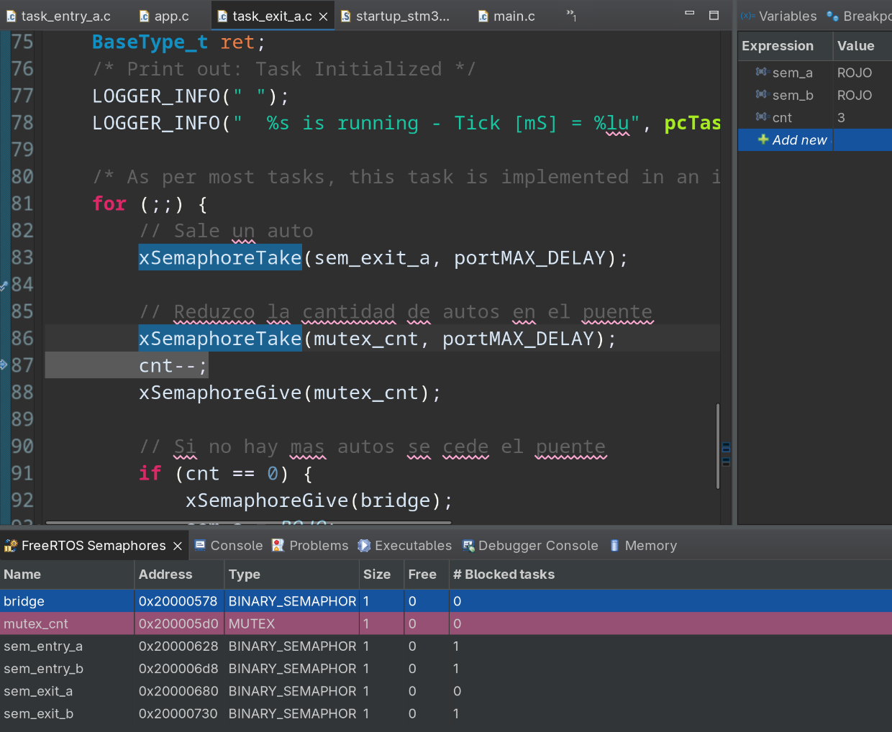
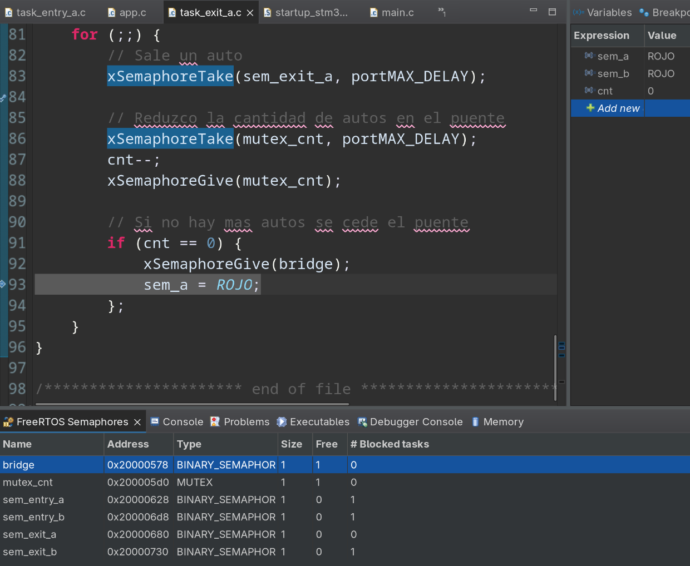

# Análisis y Explicación del Sistema de Cruce Vehicular (FreeRTOS)

Este documento contiene el análisis y la explicación detallada del funcionamiento del código fuente basado en el sistema operativo de tiempo real (**FreeRTOS**) diseñado para simular o controlar un **cruce vehicular** (*Vehicular crossing*).

Cabe destacar que el archivo `freertos.c` no fue incluido en la carga original, pero su comportamiento se infiere perfectamente a partir del resto de los archivos, ya que es el encargado de iniciar el planificador (*scheduler*) de FreeRTOS.

Un detalle crucial a tener en cuenta es que **el código actual es una plantilla o esqueleto (*skeleton code*)**. Tiene la estructura lista para implementar un sistema guiado por eventos (*Event-Triggered System - ETS*), pero los mecanismos de sincronización (semáforos o colas) y las acciones dentro de las interrupciones están comentados o vacíos, esperando a ser completados.

---

## 1. Arquitectura General del Sistema

El sistema define **5 tareas (tasks)** principales con diferentes prioridades. Las tareas representan los puntos de entrada y salida de vehículos para dos zonas o vías (A y B), además de una tarea de prueba (*Test*) que sirve para estimular al sistema de forma controlada.

### Tabla de Tareas y Prioridades

| Tarea | Archivo | Prioridad Inicial | Prioridad Dinámica | Descripción |
| :--- | :--- | :--- | :--- | :--- |
| `task_entry_a` | `task_entry_a.c` | `tskIDLE_PRIORITY + 3` (3) | No cambia | Simula/gestiona la entrada de vehículos por la vía A. |
| `task_entry_b` | *(No provisto)* | `tskIDLE_PRIORITY + 3` (3) | No cambia | Simula/gestiona la entrada de vehículos por la vía B. |
| `task_exit_a` | `task_exit_a.c` | `tskIDLE_PRIORITY + 2` (2) | No cambia | Simula/gestiona la salida de vehículos por la vía A. |
| `task_exit_b` | *(No provisto)* | `tskIDLE_PRIORITY + 2` (2) | No cambia | Simula/gestiona la salida de vehículos por la vía B. |
| `task_test` | `task_test.c` | `tskIDLE_PRIORITY + 1` (1) | Se eleva a **3** en ejecución | Tarea de prueba que genera eventos periódicos para testear el flujo. |

---

## 2. Análisis Detallado por Archivo

### `app.c` (El Orquestador e Inicializador)
Este archivo es el punto de partida de la aplicación (llamado habitualmente desde el `main()` principal).
* **Inicialización de variables:** Configura en cero los contadores globales del sistema (`g_app_cnt`, `g_tasks_cnt`, etc.) que sirven para auditoría y telemetría.
* **Creación de Tareas:** Utiliza la API de FreeRTOS `xTaskCreate()` para instanciar las 5 tareas mencionadas en la tabla anterior. 
* **Validación de seguridad:** Usa `configASSERT(pdPASS == ret)` después de crear cada tarea. Si el microcontrolador se queda sin memoria RAM (Heap) para crear una tarea, el sistema se detendrá inmediatamente aquí para facilitar la depuración.
* **Llamado a interrupciones:** Invoca a `app_it_init()` para preparar las interrupciones de hardware.

### `app_it.c` (Gestor de Interrupciones)
Este archivo maneja la interacción con el mundo físico a través de interrupciones de hardware (ISR).
* **`app_it_init()`**: Actualmente solo deshabilita y vuelve a habilitar las interrupciones a nivel de CPU (`CPSID i` / `CPSIE i`) de forma inline en ensamblador. Es un marcador de posición (*placeholder*).
* **`HAL_GPIO_EXTI_Callback(uint16_t GPIO_Pin)`**: Es la función que se ejecutará cuando ocurra una interrupción externa en un pin de los puertos GPIO (por ejemplo, al presionar un botón físico en la placa de desarrollo).
    * Tiene un condicional para detectar si el estímulo vino de `BTN_A_PIN` (el botón A).
    * *Estado actual:* Está vacío (`/* Work to be done. */`). En una implementación real, aquí se debería "despertar" a una tarea enviando un semáforo o una notificación de FreeRTOS desde la ISR (`xSemaphoreGiveFromISR`).

### `task_entry_a.c` y `task_exit_a.c` (Trabajadores de la Vía A)
Ambos archivos tienen una estructura idéntica y representan el comportamiento de las vías de tránsito.
* **`task_entry_a`**: Entra en un bucle infinito (`for(;;)`), incrementa su contador propio (`g_task_entry_a_cnt`), imprime un mensaje en el log indicando que va a esperar (`==> Task Entry A - Wait: 2500mS`) y se bloquea voluntariamente por 2500 milisegundos usando `vTaskDelay()`.
* **`task_exit_a`**: Hace exactamente lo mismo, pero con sus propias variables y textos, simulando la salida de la vía A.
* *Nota de diseño:* Al usar `vTaskDelay()`, estas tareas liberan el procesador durante 2.5 segundos, permitiendo que tareas de menor prioridad se ejecuten.

### `task_test.c` (Generador de Estímulos / Entorno de Pruebas)
Este es el archivo más dinámico y sofisticado del conjunto. Su objetivo es simular eventos de tráfico de forma automatizada sin necesidad de apretar botones físicos.

1.  **Modificación Dinámica de Prioridad:** Comienza con prioridad 1 (la más baja). Sin embargo, al iniciar ejecuta `vTaskPrioritySet(NULL, task_test_priority)`, auto-elevándose a prioridad 3. Esto se hace para asegurar que empiece a correr inmediatamente y tome el control de la inicialización de las pruebas.
2.  **Configuración por Macros (`E_TASK_TEST_X`):**
    A través de directivas de precompilación (`#if`), el programador puede cambiar el valor de `E_TASK_TEST_X` (del 0 al 5) para cambiar drásticamente el patrón de eventos que se van a probar. Dado que está configurado en `1`:
    ```c
    const e_task_test_t e_task_test_array[] = {Entry_A, Exit_A};
    ```
    El sistema recorrerá cíclicamente un arreglo que simula: *"Entra un auto a la zona A, luego sale un auto de la zona A"*.
3.  **El Bucle de Simulación:**
    Recorre el arreglo con un `switch-case`. Actualmente, los casos `case Entry_A:` y `case Exit_A:` están vacíos. En el diseño final, aquí es donde `task_test` debería enviar señales (vía colas o semáforos) para forzar a las otras tareas a reaccionar.
4.  **Demora Determinista (`vTaskDelayUntil`):**
    A diferencia de las otras tareas que usan `vTaskDelay`, esta tarea usa `vTaskDelayUntil()`. Esto garantiza una **ejecución periódica exacta cada 5000ms**, sin importar cuánto tiempo le haya tomado procesar el código interno del bucle, ideal para sistemas de tiempo real estricto.

---

## 3. Resumen del Flujo de Ejecución Actual

Si se compila y ejecuta este código tal como está ahora, se observará el siguiente comportamiento secuencial en la consola de depuración (`LOGGER_INFO`):

1.  Se ejecuta `app_init()`, se configuran las variables en 0 y se crean las 5 tareas en memoria.
2.  El planificador de FreeRTOS toma el control (desde el `freertos.c` implícito).
3.  Las tareas de alta prioridad (`task_entry_a`, `task_entry_b`, `task_exit_a`, `task_exit_b`) se ejecutan por primera vez, imprimen sus mensajes de inicialización en el log y se duermen inmediatamente por 2500ms mediante `vTaskDelay`.
4.  La tarea `task_test` se ejecuta, eleva su propia prioridad, entra a su bucle, lee el primer evento (`Entry_A`), no hace nada (porque el `switch` está vacío) y se duerme por 5000ms mediante `vTaskDelayUntil`.
5.  A los 2500ms, las tareas de entrada y salida se despiertan, incrementan sus contadores, vuelven a imprimir el log de espera y se vuelven a dormir por otros 2500ms.
6.  A los 5000ms, `task_test` se despierta, avanza al siguiente evento (`Exit_A`), y el ciclo se repite indefinidamente.

## 4. Paso 06

Se implemento el problema de Vehicular Crossing donde existen las siguientes tareas:
- `task_entry_a`. 
- `task_entry_b`.
- `task_exit_a`.
- `task_exit_b`.

Se utilizaron los siguientes semaforos:

 - `mutex_cnt`: Mutex que protege la variable que cuenta la cantidad de autos en el puente.
 - `bridge`: Semaforo binario que indica quien tiene el puente (a o b).
 - `sem_entry_a`: Semaforo binario para indicar la entrada por a.
 - `sem_exit_a`: Semaforo binario para indicar la salida por a.
 - `sem_entry_b`: Semaforo binario para indicar la entrada por b.
 - `sem_exit_b`: Semaforo binario para indicar la salida por b.

 El siguiente codigo es de `task_entry_a`. Este tambien aplica para `task_entry_b`:

```c
for (;;) {
    // Entro un auto
    ret = xSemaphoreTake(sem_entry_a, portMAX_DELAY);
    sem_a = ROJO;

    // Tomo el puento si no lo tomamos antes
    if (bridge_take == 0)
        ret = xSemaphoreTake(bridge, portMAX_DELAY);
    bridge_take = 1; // Se toma el puente

    // Verifico si hay espacio en  el puente
    if (cnt < G_TASKS_CNT_MAX) {
        xSemaphoreTake(mutex_cnt, portMAX_DELAY);
        cnt++;
        sem_a = VERDE;
        xSemaphoreGive(mutex_cnt);
    }
}
```

Codigo de la `task_exit_a` (tambien aplica para `task_exit_b`):
```c
for (;;) {
    // Sale un auto
    xSemaphoreTake(sem_exit_a, portMAX_DELAY);

    // Reduzco la cantidad de autos en el puente
    xSemaphoreTake(mutex_cnt, portMAX_DELAY);
    cnt--;
    xSemaphoreGive(mutex_cnt);

    // Si no hay mas autos se cede el puente
    if (cnt == 0) {
        xSemaphoreGive(bridge);
        sem_a = ROJO;
    };
}
```


Por otro lado, la tarea lectora bloquea el recurso de la escritora. Ademas, bloquea a otras lectoras mientras modifica la variable `readers`, que lleva la cuenta de cuantos lectores hay. El recurso se liberara cuando ya no queden lectores accediendo a este.

El siguiente codigo es el de la tarea lectora:
```c
for (;;) {
    xSemaphoreTake(mut, portMAX_DELAY);
    readers++;
    if(readers == 1){
        LOGGER_INFO("task_b: first reader, blocking writers");
        xSemaphoreTake(room_empty_mutex, portMAX_DELAY);
    }
    xSemaphoreGive(mut);
    LOGGER_INFO("task_b: inside reader");
    // reader code example
    g_task_b_cnt = g_tasks_cnt;

    xSemaphoreTake(mut, portMAX_DELAY);
    readers--;
    if(readers == 0){
        LOGGER_INFO("task_b: Last reader, writers free");
        xSemaphoreGive(room_empty_mutex);
    }
    xSemaphoreGive(mut);
    vTaskDelay(pdMS_TO_TICKS(2500));
}
```

Se envia un estimulo de `entry_a` y se toma el semaforo correspondiente:


Como el puente no estaba en uso, se toma el semaforo correspondiente:


Se verifica la cantidad de autos en el puente y si es menor al maximo establecido se toma el mutex del recurso (`cnt`). Se incremeta ya que se esta sumando un auto al puente. Ademas, se pone el semaforo en verde:


Luego de 4 `entry_a`, comenzamos con los exits. Por cada `exit` se decrementa `cnt` hasta llegar a 0, donde se libera el semaforo del puente:



