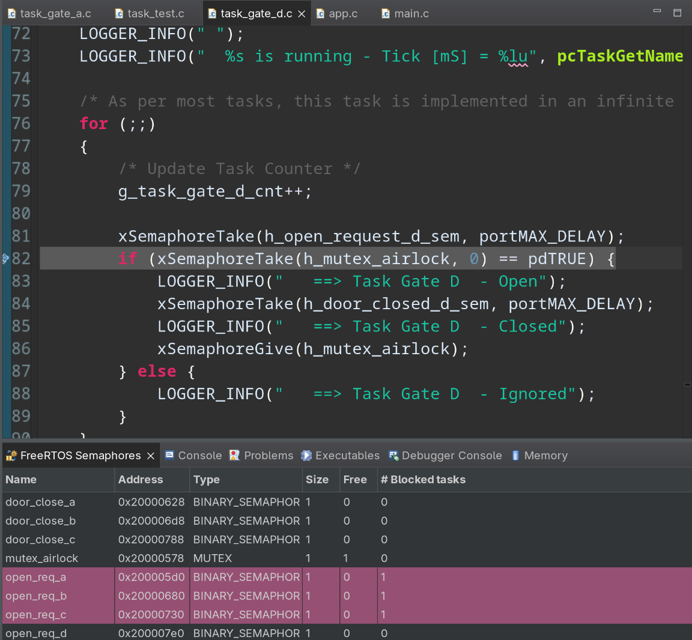
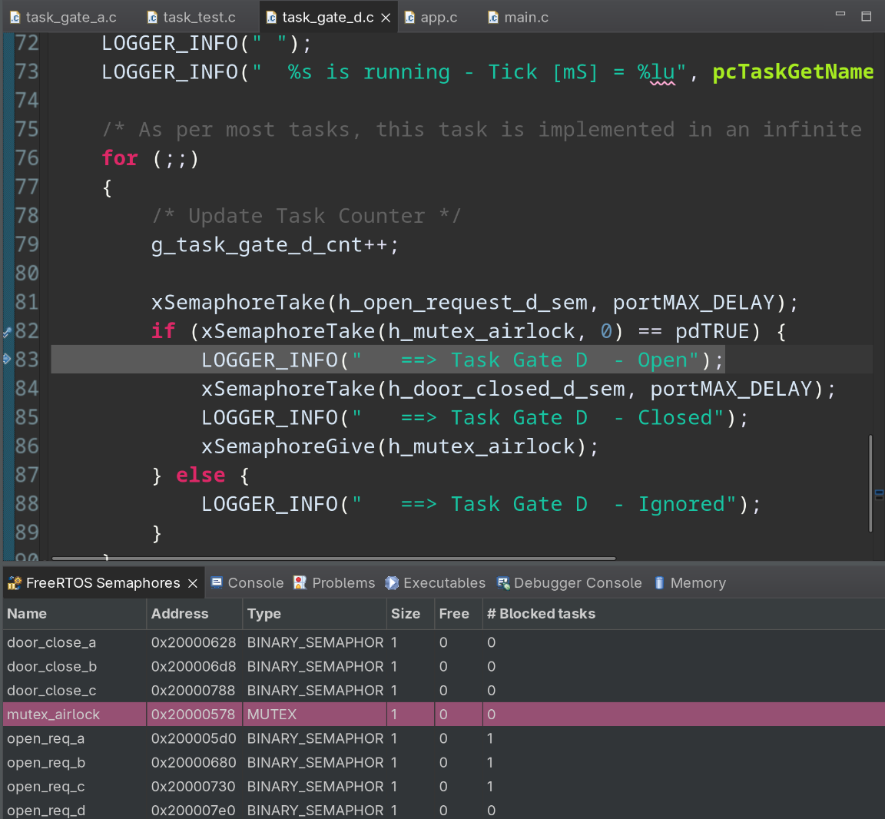
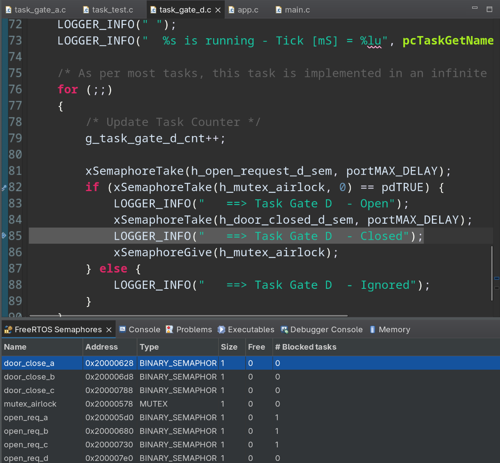
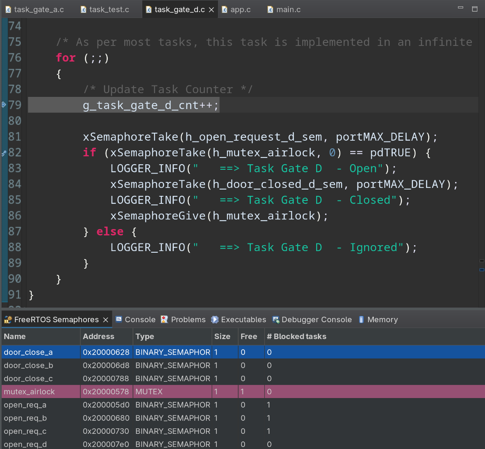

# Sistema de Control de Esclusa de Seguridad (FreeRTOS Skeleton)

Este repositorio contiene la estructura base y la plantilla arquitectónica para una aplicación de un **Sistema Dirigido por Eventos (ETS - Event-Triggered Systems)** utilizando el sistema operativo de tiempo real **FreeRTOS**.

El proyecto está diseñado para simular el control de una **Esclusa de Seguridad (Security Airlock)**, un sistema de control de acceso compuesto por múltiples puertas donde, por motivos de seguridad, no se permite que más de una compuerta esté abierta simultáneamente. En su estado actual, el código funciona como una maqueta concurrente: las tareas están creadas y se ejecutan de forma periódica imprimiendo mensajes de diagnóstico (logs), quedando preparadas para la posterior implementación de la lógica de sincronización (semáforos, mutexes o colas).

---

## 1. Arquitectura de Tareas y Prioridades

El sistema define **5 tareas (threads)** principales administradas por el planificador de FreeRTOS. Las tareas se inicializan en `app.c` con las siguientes prioridades y configuraciones:

| Tarea | Archivo Fuente | Prioridad Inicial | Descripción / Rol |
| :--- | :--- | :--- | :--- |
| `task_gate_a` | `task_gate_a.c` | **3** (`tskIDLE_PRIORITY + 3`) | Control de la Puerta / Comportamiento A. |
| `task_gate_b` | `task_gate_b.c` | **2** (`tskIDLE_PRIORITY + 2`) | Control de la Puerta / Comportamiento B. |
| `task_gate_c` | `task_gate_c.c` | **3** (`tskIDLE_PRIORITY + 3`) | Control de la Puerta / Comportamiento C. |
| `task_gate_d` | `task_gate_d.c` | **2** (`tskIDLE_PRIORITY + 2`) | Control de la Puerta / Comportamiento D. |
| `task_test`   | `task_test.c`   | **1** $\rightarrow$ **3** (Dinámica) | Generador de estímulos y eventos de prueba. |

---

## 2. Análisis Detallado de los Archivos

### 📂 `app.c` (Inicialización de la Aplicación)
Es el punto de entrada de la lógica de usuario antes de que se inicie el scheduler de FreeRTOS.
* **Inicialización de Variables:** Resetea contadores globales de diagnóstico (`g_app_cnt`, `g_app_tick_cnt`, etc.).
* **Creación de Tareas:** Invoca a `xTaskCreate` para cada una de las 5 tareas y utiliza la macro `configASSERT` para asegurar que la asignación de memoria en el heap haya sido exitosa.
* **Configuración Periférica:** Llama a `app_it_init()` para preparar el entorno de interrupciones y arranca un contador de ciclos de hardware (`cycle_counter_init`).

### 📂 `task_gate_a.c` / `_b.c` / `_c.c` / `_d.c` (Tareas de las Compuertas)
Todas estas tareas comparten una estructura homóloga en este punto del desarrollo:
* Implementan un **bucle infinito** (`for(;;)`).
* En cada iteración incrementan su contador de diagnóstico individual (ej. `g_task_gate_a_cnt++`).
* Envían un mensaje al logger indicando que se encuentran en estado de espera.
* Bloquean de forma voluntaria su ejecución durante **2500 ms** usando `vTaskDelay(pdMS_TO_TICKS

## Paso 06

Se implemto un sistema de control de tipo puerta-exclusa, en donde existe una habitacion con 4 puertas (A, B, C y D) las cuales sirven para egreso/ingreso de la misma.

Para esto las siguientes tareas controlan el egreso/ingreso de cada puerta:
- `task_gate_a`.
- `task_gate_b`.
- `task_gate_c`.
- `task_gate_d`.

> [!IMPORTANT]  
> Asumimos que una vez una persona ingreso, el proximo estimulo de `OPEN` pertenece a la persona en cuestion. Ademas, si despues de un `OPEN` pero antes de su `CLOSE` se produce otro `OPEN`, este ultimo se ignora, bloqueando la puerta.

El siguiente codigo corresponde a `task_gate_a`. El resto de las gate, tienen un codigo similar:
```c
for (;;)
{
    /* Update Task Counter */
    g_task_gate_a_cnt++;

    xSemaphoreTake(h_open_request_a_sem, portMAX_DELAY);
    if (xSemaphoreTake(h_mutex_airlock, 0) == pdTRUE) {
        LOGGER_INFO("   ==> Task Gate A  - Open");
        xSemaphoreTake(h_door_closed_a_sem, portMAX_DELAY);
        LOGGER_INFO("   ==> Task Gate A  - Closed");
        xSemaphoreGive(h_mutex_airlock);
    } else {
        LOGGER_INFO("   ==> Task Gate A  - Ignored");
    }
}
```

Se toma el semaforo de `OPEN`:


Como la habitacion estaba vacia, se toma el mutex `mutex_airlock`. En caso de no poder tomar la habitacion, se ignora la solicitud:


Despues la tarea se queda esperado un estimulo de `CLOSE`:


Finalmente se libera el `mutex_airlock` asumiendo que el siguiente `OPEN_DOOR` es de la persona dentro:


